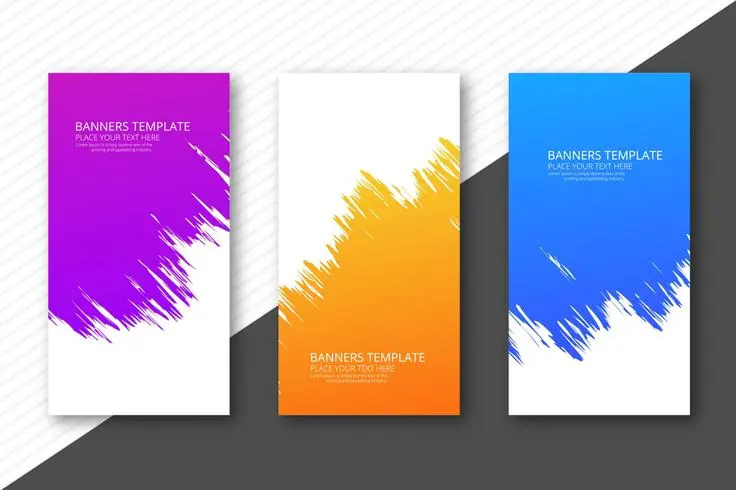

  <h1>🚀 Nom du Projet</h1>
  
Une application web interactive et responsive

  
  

  
  
  
  

  
  

  <!-- TODO Modifier le chemin de l'ancre -->
    <a href="./index.html">Voir la démo</a> •
    <a href="#-présentation-rapide">Présentation projet</a> •
    <a href="#-ce-que-jai-appris">Ce que j'ai appris</a> •
    <a href="#-à-propos-de-lautrice">À propos</a>
  

  
  

## 🧩 Présentation rapide

Petit projet codé avec amour 💻✨  
Objectif : **[décrire le but du projet]**  
Contexte : **[formation, défi, tuto, perso...]**  
Contraintes : **[design imposé, responsive, animations, etc.]**

<!-- TODO Modifier le chemin de l'ancre -->

🔗 [Voir la démo dans le navigateur](./index.html)

## 🖼️ Aperçu

## 🔧 Technologies utilisées

- HTML5 sémantique
- SASS (Mixins, variables,...)

## ✅ Ce que j’ai appris

- [x] Mieux structurer mon HTML
- [x] Utiliser Flexbox / Grid sans pleurer
- [x] Gérer les effets au survol (hover / transitions)
- [x] Découvrir les améliorations de performances

## 🛠️ À améliorer plus tard

- ♿ Améliorer ma sémantique HTML
- 💡 Mieux structurer mes projets
- 🧪 S'entraîner à utiliser le fluid-responsive

## 👩‍💻 À propos de l’autrice

> Code, café, et curiosité technique ☕💡  
> Retrouve-moi ici → [github.com/jhauck67](https://github.com/jhauck67)

  <em>Merci d’avoir visité ce dépôt ! 
  🚂 En route vers de nouveaux projets web… 🚦</em>

  
<strong>jhauck67</strong> 
  Apprentie développeuse web

  

    <a href="https://github.com/jhauck67">GitHub</a> •
    <a href="https://jhauck67.github.io/jhauck67/">Portfolio</a> •
    <a href="https://codepen.io/jhauck67">Codepen.io</a>
  

