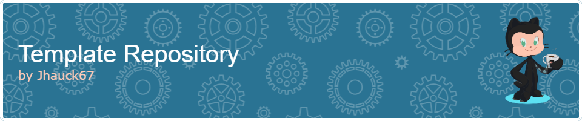

         
    
\
 
   
\


# Description

Ce projet consiste en l'intégration d'une maquette desktop et mobile pour le site du **Gaming Campus**, un établissement qui enseigne les métiers du jeu vidéo. L'objectif est de recréer les maquettes en HTML et CSS tout en optimisant le site pour le SEO.

## Technologies utilisées :

-  HTML 5
-  CSS 3
-  SASS
-  GIT
-  GitHub Pages

# Fonctionnalités :

- 🖥️ **Version Desktop** : Mise en place de la version pour les écrans de taille standard et grande taille.
- 📱 **Version Mobile** : Adaptation de la maquette pour les petits écrans (smartphones).
- 🔎 **Optimisation SEO** : Travail sur la structure du site pour le rendre plus visible dans les moteurs de recherche.
- 🖼️ **Optimisation des images** : Toutes les images ont été redimensionnées, reformattées et compressées pour un meilleur temps de chargement et une efficacité maximale.

# Détails du code :

Le code a été structuré pour être facile à maintenir et à développer.

- **SASS** est utilisé pour la gestion des styles, permettant une hiérarchisation claire et une réutilisation efficace des styles grâce à des variables, des mixins et des partials.

## Structure du projet :

```plaintext
/ (root)
│
├── index.html              # Page principale du site
├── assets                  # Dossier pour les images, polices, maquettes, styles
│   ├── fonts/              # Dossier pour les polices
│   ├── img/                # Dossier pour les images
│   ├── sketch/             # Dossier pour les maquettes
│   ├── styles/             # Dossier contenant les fichiers CSS et SASS
│   │   ├── layouts/        # Dossier pour les styles de mise en page
│   │   ├── _settings.scss  # Styles de base (typographie, variables)
│   │   ├── index.css       # Fichier principal CSS généré depuis SASS
│   │   ├── index.scss      # Fichier principal SASS
├── planification.md        # Planification du projet
├── readme.md               # Documentation du projet
```

# Aperçu

Voici un aperçu du projet, que tu peux visualiser en ligne sur GitHub Pages :

## Lien vers le site en ligne

Tu peux consulter la version en ligne de ce projet via GitHub Pages en cliquant sur le lien suivant :
[Voir le site sur GitHub Pages](https://jhauck67.github.io/Projet-Gaming-Campus/)

# Audit Lighthouse 

Le projet a été audité à l'aide de Lighthouse pour évaluer ses performances, son accessibilité, ses bonnes pratiques et son SEO. Voici les résultats :

## Performances 

First Contentful Paint   
\
Largest Contentful Paint   
\
Total Blocking Time   
\
Cumulative Layout Shift   
\
Speed Index 
\
\
Le site est parfaitement optimisé, avec un temps de chargement ultra rapide, une absence totale de blocage et de décalage de mise en page, garantissant une expérience utilisateur fluide et réactive.
\
## Accessibilité 
Le site est entièrement accessible, avec un score parfait de 100. Aucune erreur n'a été détectée sur les critères d'accessibilité, garantissant que le contenu est disponible pour tous les utilisateurs, y compris ceux ayant des besoins spécifiques.

## Bonnes pratiques 
Le projet respecte les meilleures pratiques en matière de sécurité et de fiabilité, avec un score de 100. Toutes les vérifications recommandées pour assurer la sécurité, telles que la gestion des en-têtes CSP et HSTS, ont été appliquées.

## SEO 
Le site est optimisé pour le référencement naturel (SEO) avec un score de 100. Les bonnes pratiques SEO sont respectées, ce qui permet d'améliorer la visibilité du site sur les moteurs de recherche.

# Améliorations possibles :

- [ ] Optimisation des éléments visuels :

  - [ ] Retrait des boutons : Retravailler les boutons pour améliorer leur interactivité et leur accessibilité. Ajouter des animations CSS ou JavaScript pour une meilleure expérience utilisateur.
  - [ ] Ajout d'ancres : Mettre en place des ancres pour une meilleure navigation entre les sections du site.
  - [ ] Optimiser les .png en .webp
  - [ ] Ajouter des attributs **width** et **height** aux balises ``
  - [ ] Remplacer les balises `<i>` de Font Awesome par des `` `.sgv`
  - [ ] Ajouter `font-display` pour améliorer la performance

- [ ] Modifications SEO friendly :

  - [ ] Balises <meta> : Auteur de la page pour améliorer la visibilité sur les moteurs de recherche.

- [ ] Fichier sitemap.xml : Créer et soumettre un fichier sitemap pour faciliter l'indexation du site par les moteurs de recherche.

- [ ] Rechercher des propositions d'améliorations SEO Friendly

- [ ] Ajouter des balises Open Graph

# Auteur :

Jhauck67 (Développeuse web)

# Liens utiles :

[Portfolio de Jennifer](https://jhauck67.github.io/jenniferhauck/index.html)  
[Voir le site en ligne](https://jhauck67.github.io/Projet-Gaming-Campus/)
